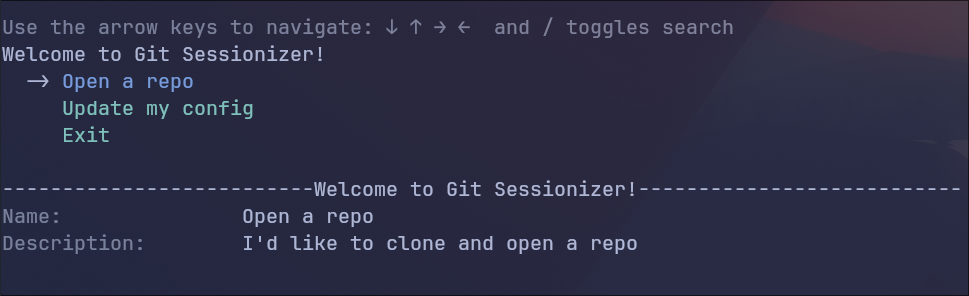

# git-sessionizer

### a little project to automate the creation of a sessionized git repo in your editor of choice, with tmux, or not...

the application uses github authentication and some interactive prompts to...

- init the application
- - authenticates with github via device flow
- lets you search through your public and private repositories
- select and clone a repo
- - clone with SSH or HTTP
- - - standard or bare (if you like worktrees) repository
- cd into directory
- start a tmux session, if that's your cup of tea
- and finally, open the repo in your preferred editor (vscode, vim, or neovim)
- - (soon) emacs and other stuff as well



TODO:

- [x] implement choice between standard or bare repo
- [ ] detect if tmux is active. if it is, attach and switch to the new window. otherwise create the new session as normal.
- [ ] additional editors
- [ ] bubbletea? bubbletea! (someone please help..... plz)

## To get started:

1. ```sh
   $ git clone https://github.com/giuseppe-g-gelardi/git-sessionizer.git
   ```
3. cd git-sessionizer
4. go mod tidy ...?
5. go run ./cmd/session

## Install

```sh
$ go install github.com/giuseppe-g-gelardi/git-sessionizer/cmd/session@latest
```

please keep in mind this is still VERY pre-alpha. id advise against installing unless you know what you're doing.

See [releases](https://github.com/giuseppe-g-gelardi/git-sessionizer/releases) for binaries

## config file location:

- windows:
- - APPDATA\local\session_config.yaml

- macos & linux:
- - /home/{user}/.config/session_config.yaml (~/.config/)

## contributing:

1. create a fork
2. create a branch
3. make a pr?
4. get mad at me when you realize i dont know how to merge it -- kidding, mostly

but seriously, would be cool :D
